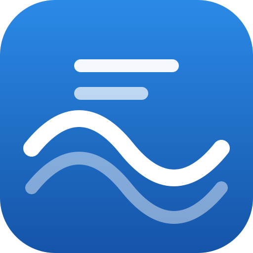

<p align="center">
  
</p>

<h1 align="center">MCP Server for Wave</h1>

<p align="center">
  <strong>Complete access to Wave Accounting from Claude, Codex, and any other MCP client</strong>
</p>

<p align="center">
  <code>74 tools</code> &bull;
  <code>42/42 mutations</code> &bull;
  <code>11/11 queries</code> &bull;
  <code>7 resources</code>
</p>

<p align="center">
  <a href="https://www.npmjs.com/package/@oliverames/mcp-server-for-wave">
    
  </a>
  <a href="LICENSE">
    
  </a>
  <a href="https://www.buymeacoffee.com/oliverames">
    
  </a>
</p>

---

Wave gives small businesses free accounting and invoicing, and a GraphQL API that
covers nearly all of it. This server puts that entire API in front of an AI
assistant: invoices and payments, estimates and deposits, customers, vendors,
products, sales taxes, the chart of accounts, and double-entry bookkeeping.

Every query is verified against Wave's live schema in CI, and the tools that
change or send anything stay hidden until you turn them on.

## Why This Exists

Bookkeeping is mostly translation. You have a receipt, a bank line, an email
promising to pay next week, and none of it is in the shape your books want. The
work is not hard, it is just constant, and it is exactly the kind of task worth
handing to an assistant that can hold the whole picture at once.

Doing that well needs more than a few convenience endpoints. An assistant that
can list invoices but not record the payment, or draft an estimate but not
convert it, forces you back into the web app halfway through every task. So this
server covers the API completely: all 42 mutations, all 11 root queries, every
sub-resource on a business. If Wave's API can do it, a tool here does it.

Two decisions shape the rest:

**Writes are off by default.** Wave has genuinely irreversible operations.
Sending an invoice emails a real customer. Deleting one is permanent. A default
install exposes 30 read-only tools; the other 44 appear only when you set
`WAVE_ALLOW_WRITES=1`. Reading your books should not require trusting a model
with your outbox.

**Errors explain themselves.** Wave rejects an unbalanced transaction without
telling you which figure is wrong. This server compares the anchor against the
line items first and reports the difference. A category word that matches no
account produces the list of real account names rather than a silent guess at
the first one.

## Quick Start

```json
{
  "mcpServers": {
    "wave-mcp-server": {
      "command": "npx",
      "args": ["-y", "@oliverames/mcp-server-for-wave@latest"],
      "env": {
        "WAVE_ACCESS_TOKEN": "your_token_here"
      }
    }
  }
}
```

Then ask for your businesses and set one as the default:

```
List my Wave businesses and set the first one as the default.
```

### Get a token

Create an application and generate an access token in the
[Wave developer portal](https://developer.waveapps.com/). Wave's tokens expire,
so expect to refresh it periodically, or use the
[hosted connector](#hosted-connector) which handles refresh for you.

### Install as a plugin

The repo doubles as a single-plugin marketplace for hosts that support them:

```bash
/plugin marketplace add oliverames/wave-mcp-server
/plugin install wave-mcp-server
```

### Install in Codex

```bash
codex mcp add wave-mcp-server \
  --env WAVE_ACCESS_TOKEN=your_token_here \
  -- npx -y @oliverames/mcp-server-for-wave@latest
```

Verify with `codex mcp list`. Startup takes about 0.2s, well inside Codex's
10-second `startup_timeout_sec`, and the retry budget is capped below its
60-second `tool_timeout_sec` so a slow API surfaces Wave's real error rather
than a client timeout.

### Enable write tools

```json
"env": {
  "WAVE_ACCESS_TOKEN": "your_token_here",
  "WAVE_ALLOW_WRITES": "1"
}
```

This registers the 44 tools that create, change, delete, or email records.
Without it they are not advertised at all, so a model cannot call one by
guessing its name.

### Docker

```bash
docker build -t wave-mcp-server .
docker run --rm -i -e WAVE_ACCESS_TOKEN=your_token_here wave-mcp-server
```

The `-i` matters: the server speaks JSON-RPC on stdin and stdout.

### 1Password token lookup

Rather than pasting a token into a config file, point the server at a secret
reference and it will shell out to the `op` CLI on startup:

```json
"env": { "WAVE_OP_PATH": "op://Development/Wave/credential" }
```

`WAVE_ACCESS_TOKEN_FILE` works the same way for a file on disk.

## What You Can Do

**Bill a customer end to end**

```
Create an invoice for Acme Corp with 10 hours of consulting at $150/hour,
due in 30 days. Approve it and email it to billing@acme.com.
```

**Quote, then convert**

```
Create an estimate for the website redesign package with a 25% deposit,
send it, and convert it to an invoice once they accept.
```

**Record a receipt**

```
Log a $45.99 expense from Office Depot on 2026-03-15 for office supplies,
paid from Business Checking.
```

**Split a transaction**

```
Record a $100 withdrawal from checking: $60 to fuel and $40 to meals.
```

**Reconcile a processor payout**

```
A Stripe payout of $97 landed in checking: $100 of consulting income
less a $3 processing fee.
```

**Chase what is owed**

```
Show me every unpaid invoice over $500, sorted by amount due, and which
customers carry the largest overdue balances.
```

## Tools Reference

Names are prefixed `wave_` so they do not collide with other MCP servers.
Tools marked **W** require `WAVE_ALLOW_WRITES=1`.

### Businesses and reference data

| Tool | Purpose |
|------|---------|
| `wave_list_businesses` | List reachable businesses |
| `wave_get_business` | Full business detail |
| `wave_set_default_business` | Set the session default |
| `wave_get_invoice_estimate_settings` | Accent color and logo |
| `wave_auth_status` | How credentials resolved, and what is gated. Makes no API call |
| `wave_get_user` | Account the token belongs to |
| `wave_get_oauth_application` | Application that issued the token |
| `wave_list_currencies` / `wave_get_currency` | Supported currencies |
| `wave_list_countries` / `wave_get_country` | Countries and their provinces |
| `wave_get_province` | One province or state |
| `wave_list_account_types` | The five top-level account types |
| `wave_list_account_subtypes` | Subtypes, which `wave_create_account` requires |

### Chart of accounts

| Tool | Purpose |
|------|---------|
| `wave_list_accounts` / `wave_get_account` | Accounts with balances |
| `wave_create_account` **W** | Add an account |
| `wave_patch_account` **W** | Rename or renumber |
| `wave_archive_account` **W** | Hide from pickers, keep history |

### Customers, vendors, products, taxes

| Tool | Purpose |
|------|---------|
| `wave_list_customers` / `wave_get_customer` | Customers with balances |
| `wave_create_customer` / `wave_patch_customer` / `wave_delete_customer` **W** | Manage customers |
| `wave_list_vendors` / `wave_get_vendor` | Vendors (read-only in Wave's API) |
| `wave_list_products` / `wave_get_product` | Products and services |
| `wave_create_product` / `wave_patch_product` / `wave_archive_product` **W** | Manage products |
| `wave_list_sales_taxes` / `wave_get_sales_tax` | Taxes and rate history |
| `wave_create_sales_tax` / `wave_patch_sales_tax` / `wave_archive_sales_tax` **W** | Manage taxes |

### Invoices and payments

| Tool | Purpose |
|------|---------|
| `wave_list_invoices` / `wave_get_invoice` | Invoices with items and payments |
| `wave_create_invoice` / `wave_patch_invoice` / `wave_clone_invoice` **W** | Build invoices |
| `wave_approve_invoice` **W** | Move a draft into the books |
| `wave_send_invoice` **W** | Emails the customer |
| `wave_mark_invoice_sent` **W** | Record delivery made outside Wave |
| `wave_delete_invoice` **W** | Permanent |
| `wave_get_invoice_payment` | One payment |
| `wave_create_invoice_payment` / `wave_patch_invoice_payment` / `wave_delete_invoice_payment` **W** | Record payments |
| `wave_send_invoice_payment_receipt` **W** | Emails the customer |

### Estimates and deposits

| Tool | Purpose |
|------|---------|
| `wave_list_estimates` / `wave_get_estimate` | Estimates with history and deposits |
| `wave_create_estimate` / `wave_patch_estimate` / `wave_clone_estimate` **W** | Build estimates |
| `wave_approve_estimate` **W** | Approve a draft |
| `wave_send_estimate` **W** | Emails the customer |
| `wave_mark_estimate_sent` / `wave_mark_estimate_accepted` **W** | Record offline delivery and acceptance |
| `wave_reset_estimate_acceptance` **W** | Undo an acceptance |
| `wave_send_estimate_acceptance_email` **W** | Emails the customer |
| `wave_generate_estimate_pdf` **W** | Render a PDF |
| `wave_convert_estimate_to_invoice` **W** | Turn an accepted estimate into an invoice |
| `wave_delete_estimate` **W** | Permanent |
| `wave_get_estimate_payment` | One deposit payment |
| `wave_create_estimate_deposit_payment` / `wave_update_estimate_deposit_payment` / `wave_delete_estimate_payment` **W** | Record deposits |
| `wave_send_estimate_deposit_receipt` **W** | Emails the customer |

### Bookkeeping

| Tool | Purpose |
|------|---------|
| `wave_create_money_transaction` **W** | One expense, income, or transfer |
| `wave_create_money_transactions` **W** | Bulk import, applied atomically |
| `wave_create_deposit_transaction` **W** | A payout whose net differs from gross |
| `wave_create_expense_from_receipt` **W** | Expense, account matched from a category word |
| `wave_create_income_from_payment` **W** | Income, account matched from a category word |

## Resources

Read-only JSON views for grounding context. Everything here is also reachable
through a tool, so hosts that ignore resources lose nothing.

`wave://businesses` &bull; `wave://accounts` &bull; `wave://customers` &bull;
`wave://vendors` &bull; `wave://products` &bull; `wave://sales-taxes` &bull;
`wave://account-taxonomy`

## How Transactions Work

Wave is double-entry, so `wave_create_money_transaction` has two sides:

- The **anchor** is the account money physically moved through, a bank account
  or credit card, with a direction of `DEPOSIT` or `WITHDRAWAL`.
- The **line items** are the categories it is attributed to. Their amounts must
  total the anchor amount.

A $50 office-supplies expense paid from checking is one anchor (checking,
`WITHDRAWAL`, `50.00`) and one line item (Office Supplies, `50.00`). A split is
the same anchor with more line items.

Every transaction carries an `external_id`. Wave deduplicates on it, so passing
a stable value of your own makes retries safe; one is generated when you omit
it.

## Environment Variables

| Variable | Required | Default | Description |
|----------|----------|---------|-------------|
| `WAVE_ACCESS_TOKEN` | Yes | (none) | OAuth2 bearer token from the Wave developer portal |
| `WAVE_BUSINESS_ID` | No | (none) | Default business, so tools can omit `business_id` |
| `WAVE_ALLOW_WRITES` | No | off | Set to `1` to register the 44 tools that change or send data |
| `WAVE_ACCESS_TOKEN_FILE` | No | (none) | Read the token from a file instead |
| `WAVE_OP_PATH` | No | (none) | Read the token from 1Password, e.g. `op://Vault/Item/credential` |
| `WAVE_TIMEOUT_MS` | No | `20000` | Per-request timeout |
| `WAVE_TOTAL_BUDGET_MS` | No | `50000` | Total time for one call including retries |
| `WAVE_MAX_RESPONSE_BYTES` | No | `8388608` | Reject responses above this size |
| `WAVE_HTTP_RETRIES` | No | `2` | Retries on 429 and 5xx |
| `WAVE_DISABLE_AGENT_CONFIG_FALLBACK` | No | off | Read only the environment, not agent config files |

Credentials resolve in order: environment, then the host agent's own config
file, then `WAVE_ACCESS_TOKEN_FILE`, then 1Password. Reading the agent config
matters because MCP clients launch this server as a subprocess, so a value in
`claude_desktop_config.json` or `~/.codex/config.toml` reaches it only if the
user wired it through by hand.

## Amount Handling

Money is sent to Wave as strings, not floats, so `0.1 + 0.2` cannot become
`0.30000000000000004` on the way to your ledger. Balance checks compare minor
units as integers for the same reason.

One exception, and it is Wave's: `moneyDepositTransactionCreate` types its
amounts as `Float` rather than `Decimal`, so `wave_create_deposit_transaction`
sends numbers there because the API accepts nothing else.

## Wave API Limitations

These are constraints in Wave's API, not gaps here. Each was confirmed against
the live schema.

- **Transactions cannot be read back.** Wave creates money transactions but
  exposes no query to list them; there is no `transactions` connection on
  `Business`. Review them in the web app.
- **Vendors are read-only.** The schema has no `vendorCreate`, `vendorPatch`,
  or `vendorDelete`.
- **Money transactions cannot reference a vendor.**
  `wave_create_expense_from_receipt` records the name in the description.
- **`wave_patch_estimate` demands fields you are not changing.** Wave marks
  seven of them required on the patch input; read the estimate first and pass
  its current values back.
- **`wave_patch_account` needs the account's current `sequence`** as an
  optimistic-concurrency check.
- **Line items must reference a product.** No free-text lines.
- **`wave_create_deposit_transaction` returns no ID.**
- **Bills, receipts, payroll, and reports have no API.**
- **No file attachments.** Receipt images cannot be uploaded.
- **Rate limits are tight**, roughly two concurrent requests.
- **Un-archiving is web-app only.**

## Hosted Connector

A Cloudflare Worker serves the same tools at **https://wave.amesvt.com/mcp**,
with per-user OAuth instead of a shared token. Users authorize against their own
Wave account, tokens are encrypted before storage, and write access is chosen
at authorization time so a read-only connection cannot be escalated later.

See [worker/README.md](worker/README.md) for setup and the security model.

## Architecture

```
index.js                     Single-file server: client, 74 tools, 7 resources
  createWaveServer()         Factory over injected credentials, shared by
                             the stdio process and the hosted Worker
scripts/
  smoke-validate-graphql.mjs Schema-check every query against live Wave
  smoke-list-tools.mjs       Start over stdio and enumerate what is advertised
  smoke-packed-install.mjs   Pack, install, and launch the way npx does
  sync-plugin-metadata.mjs   Propagate the version to every host manifest
  check-release-consistency  Fail the build when anything disagrees
  build-mcpb.mjs             Desktop bundle
worker/                      Hosted OAuth connector
test/unit.test.mjs           57 tests, no network
```

The tool layer lives in one file on purpose. It is imported unchanged by the
Worker, so the hosted and local servers cannot drift apart.

### Verification without credentials

Wave validates a GraphQL document and coerces its variables *before* it checks
authentication. An `UNAUTHENTICATED` response therefore means the query is
correct, while `GRAPHQL_VALIDATION_FAILED` means it is not.

CI exploits that to schema-check all 64 documents on every push with no token
at all, which catches a field Wave renames before a user does.

## Building

```bash
npm install
npm test                  # 57 unit tests, no network
npm run smoke:list-tools  # start over stdio, enumerate tools
npm run smoke:packed      # pack, install, and launch via the bin symlink
npm run smoke:schema      # validate every query against live Wave
npm run release:check     # version parity across 8 manifests
npm run build:mcpb        # desktop bundle
```

Contributions welcome. See [CONTRIBUTING.md](CONTRIBUTING.md).

## Not Affiliated With Wave

An independent project, not affiliated with, endorsed by, or sponsored by Wave
Financial Inc. Wave Financial Inc. owns the Wave name, logo, and marks; the icon
above is theirs and is used only to identify the service this server connects
to. Originally forked from
[vinnividivicci/wave_mcp](https://github.com/vinnividivicci/wave_mcp), then
rewritten.

---

<p align="center">
  <a href="https://www.buymeacoffee.com/oliverames">
    
  </a>
</p>

<p align="center">
  <sub>
    Built by <a href="https://ames.consulting">Oliver Ames</a> in Vermont
    &bull; <a href="https://github.com/oliverames">GitHub</a>
    &bull; <a href="https://linkedin.com/in/oliverames">LinkedIn</a>
    &bull; <a href="https://bsky.app/profile/oliverames.bsky.social">Bluesky</a>
  </sub>
</p>
